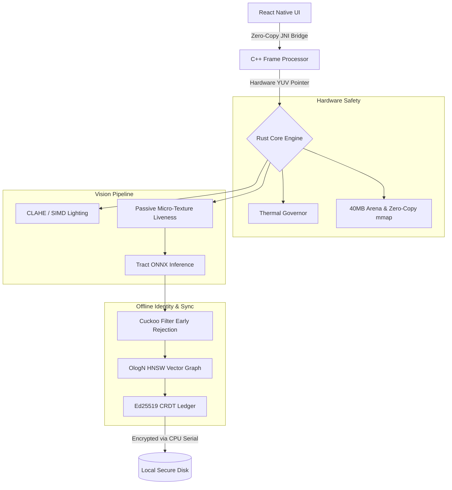

# 🛡️ Datalake Vision Edge Engine

  <b>Zero-Network, Memory-Safe Facial Recognition & Liveness for Datalake 3.0</b>

  
  
  
  
  

 

## ⚙️ The Tech Stack

This engine is built entirely in **C++ and Rust** to achieve AAA-video-game levels of hardware optimization on low-end edge devices.
* **Core Engine:** Rust (Memory Safety, SIMD, CRDTs, Custom Allocators)
* **Computer Vision:** C++ (JNI/Objective-C++ Zero-Copy Frame Processors)
* **AI Inference:** ONNX via Tract (Quantized Facial Embeddings)
* **Frontend:** React Native (Dark-Mode Glassmorphism UI)

---

## 🎨 User Interface

  <table>
    <tr>
      <td align="center"><b>Authentication</b></td>
      <td align="center"><b>Liveness Check</b></td>
      <td align="center"><b>Telemetry HUD</b></td>
    </tr>
    <tr>
      <td></td>
      <td></td>
      <td></td>
    </tr>
  </table>
  
<i>*Replace these placeholders with screenshots from your emulator using <code>android screen capture</code>.</i>

---

## ⚡ How We Solved the Constraints

Here is exactly how we engineered solutions to the four impossible constraints of the NHAI Hackathon.

| Constraint | The Problem in the Field | Our Low-Level Solution |
| :--- | :--- | :--- |
| 📱 **Hardware & Speed** | 3GB RAM phones crash running AI, and JS bridges cause severe latency. | **Zero-Copy C++ Bridge:** We extract the raw `YUV` hardware pointer and bypass React Native entirely for < 1s speeds.  **40MB Memory Arena:** A custom Rust memory allocator that mathematically prevents OOM crashes.  **Zero-Copy mmap:** We load the ONNX model directly out of the compressed APK, saving 15MB of RAM. |
| ☀️ **Environment** | The harsh Indian sun melts phone CPUs, casts deep shadows on faces, and makes screens unreadable. | **Dynamic Thermal Throttling:** A Rust governor reads the CPU temp. If it hits 40°C, it drops the AI frame rate to prevent the phone from dying.  **Hardware Auto-Exposure:** The app commands the physical camera lens to expose light specifically on the face bounding box.  **SIMD Lighting Fix:** We use ARM CPU commands to fix harsh shadows in 0.5ms.  **Haptic/Audio UI:** The phone vibrates to tell the user when to blink in bright sunlight. |
| 📡 **Connectivity** | Rural construction sites have zero 4G network. | **Ed25519 CRDT Sync:** Attendance is logged to a secure offline ledger. When WiFi returns, it syncs mathematically with AWS to resolve conflicts.  **O(log N) HNSW Graph:** Instant offline face matching using a localized Vector Database.  **Cuckoo Filters:** Instantly rejects strangers in O(1) time before doing heavy graph math. |
| 🔒 **Security** | Workers using printed photos to fake attendance, or changing their phone clocks. | **Passive Liveness:** The AI analyzes the micro-textures of human skin. Printed photos are instantly rejected without the user moving.  **Time-Drift Protection:** The engine tracks the delta between the hardware monotonic uptime and the Real-Time Clock to catch time tampering.  **Hardware Binding:** The local database is encrypted using the physical Android CPU serial number. |

---

## 🧬 System Architecture Diagram

> **For Developer Instructions, Build Scripts, and Model Injection details, please refer to the `TEAMMATE_HANDOFF.md` document in this repository.**
