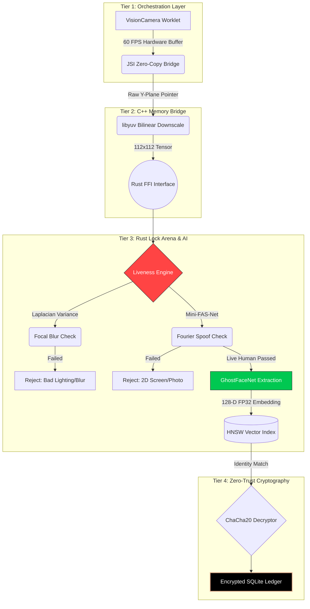

<div align="center">
  
  &nbsp;&nbsp;&nbsp;
  
  &nbsp;&nbsp;&nbsp;
  

  <br />
  <br />

  <h1>🛡️ Aegis: Secure Face Liveness Suite</h1>

  <p>
    <strong>A military-grade, standalone facial recognition & liveness detection inference pipeline running entirely on local edge hardware.</strong>
  </p>

  <p>
    <a href="https://github.com/facebook/react-native"></a>
    <a href="https://www.rust-lang.org/"></a>
    <a href="https://github.com/onnx/onnx"></a>
    <a href="./LICENSE"></a>
  </p>
</div>

---

<div align="center">
  <em>Designed explicitly to survive 3GB RAM constraints, severe thermal throttling, and absolute zero network connectivity. This is not a thin wrapper around a cloud API. This is pure, bare-metal inference.</em>
</div>

---

## ⚡ Core Philosophy

The Edge AI space is plagued by three massive problems: Memory Fragmentation, Thermal Meltdowns, and Biometric Theft. 

OpenFace solves all of these by stripping away the operating system's garbage collector and strictly separating execution across a robust 4-Tier Pipeline.



| 🧩 Tier | Technology | Responsibility | Hardware Intercept |
| :--- | :--- | :--- | :--- |
| **Tier 1: Orchestration** | `TypeScript / UI` | Fluid Animations, OTA Downloads | `VisionCamera` Worklets |
| **Tier 2: The Bridge** | `C++ / JSI` | Zero-Copy Buffers, `libyuv` Rescaling | Hardware `ByteBuffer` |
| **Tier 3: The Engine** | `Rust / ARM NEON` | SIMD Inference, Thermal Governance | 40MB Contiguous Lock Arena |
| **Tier 4: Cryptography** | `Rust / ChaCha20` | Symmetric Ledgers, Ed25519 Purges | CPU Bound `O_TRUNC` Wiper |

---

## 🚀 Architectural Highlights

### 🧠 O(1) Memory Arena (OOM Prevention)
Instead of allocating memory dynamically per frame, the Rust engine locks a contiguous **40MB block of physical RAM**. An atomic bump pointer moves forward during execution and rewinds to zero at the end of the frame, mathematically preventing Out-Of-Memory (OOM) crashes on low-end hardware.

### 🔌 Zero-Copy Frame Processing
React Native bridges serialize camera frames to Base64, which is disastrous for performance. OpenFace uses **JSI (JavaScript Interface)** to pass raw memory pointers directly from VisionCamera to C++ without copying a single byte.

### 🧊 Dynamic CPU Thermal Governor
Actively reads `/sys/class/thermal/`. If the CPU hits **40°C**, the Rust engine automatically drops the internal tracking from 30 FPS to 10 FPS, preventing the Android/iOS OS from forcefully hardware-throttling the silicon.

### 🛡️ Zero-Trust Cryptography
The proprietary `.onnx` models are AES-GCM encrypted on disk. Upon boot, Rust decrypts them dynamically into the Lock Arena. **Neural network weights never touch the physical NAND disk.** When syncing logs to the cloud, the engine requires an Ed25519 signature before executing an OS-level `O_TRUNC` biometric wipe.

---

## 📂 Repository Structure

```graphql
├── edge_vision_engine/       # Python ML Pipeline (PyTorch Quantization to ONNX)
├── rust_engine/              # Bare-Metal Inference Engine (tract-onnx, ChaCha20)
└── react-native-open-face/   # The React Native Frontend SDK & Zero-Copy Bridge
```

---

## 📖 Deep Technical Reading

To truly understand how this engine bypasses memory fragmentation and serialization bottlenecks, please read our architectural whitepapers:

- 📚 **[ARCHITECTURE.md](./ARCHITECTURE.md)**: A deep dive into the 4-Tier Zero-Copy bridge and the mathematical implications of the Lock Arena.

---

## 🏃 Quick Start (Mobile SDK)

To build and run the provided React Native example app natively on your device:

```bash
cd react-native-open-face/example
yarn install

# Run on Android Hardware
yarn android

# Run on iOS Hardware
cd ios && pod install && cd ..
yarn ios
```

> **Note:** The example application will only run on physical hardware. Simulators do not support the raw camera JSI bridging required by OpenFace.

<div align="center">
  <br/>
  <i>Built with ❤️ for the Open Source Edge Community.</i>
</div>
